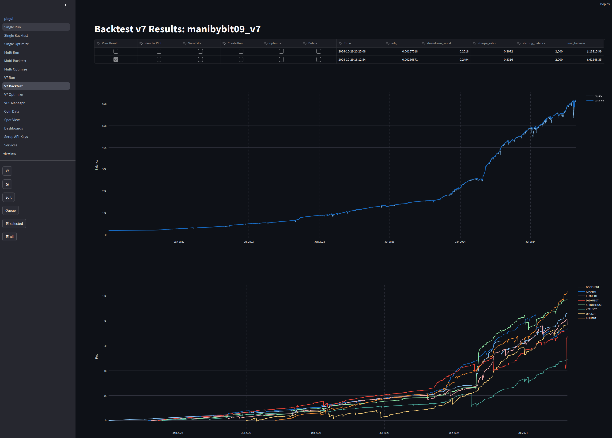

# GUI for Passivbot

v0.3

## Overview
Passivbot GUI (pbgui) is a WEB Interface for Passivbot programed in python with streamlit





## Requirements
- Python 3.8.x and higher
- Streamlit 1.26.0 and higher
- Linux (Windows not suppoted at the moment)

## Installation
```
git clone https://github.com/msei99/pbgui.git
cd pbgui
pip install -r requirements.txt
```
## Running
```
streamlit run pbgui.py &
```
Open http://localhost:8501 with Browser\
Password = PBGui$Bot!\
Change Password in file: .streamlit/secrets.toml\
On First Run, you have to select your passivbot directory

## v0.3 (14-09-2023)
- Setup: API-Editor
- Check connection to exchange and get Wallet Balance

## v0.2 (11-09-2023)
- Run: Interface for manager (start/stop/edit live configs)
- Security: Adding Login credentials

## v0.1 (24-08-2023)
First release with basic backtest and optimization functionality

## Roadmap
- Run: Display logfiles
- Run: Backtest live configs
- Optimizer: add/edit configs/optimize/*.hjson
- Backtest: open configs from filesystem
- Backtest: open configs from github
- Support for Windows
- Run: Display Orders
- Run: Display Positions / Open Orders and Chart
- Run: History PNL, Balance and more
- Backtest: Database for config/results
- Optimizer: Run multiple optimizer sessions
- Optimizer: Database for optimizer results
- Optimizer: Queue for optimizaions
- ...

## Links:
- Passivbot https://www.passivbot.com/en/latest/
- Streamlit https://streamlit.io/
